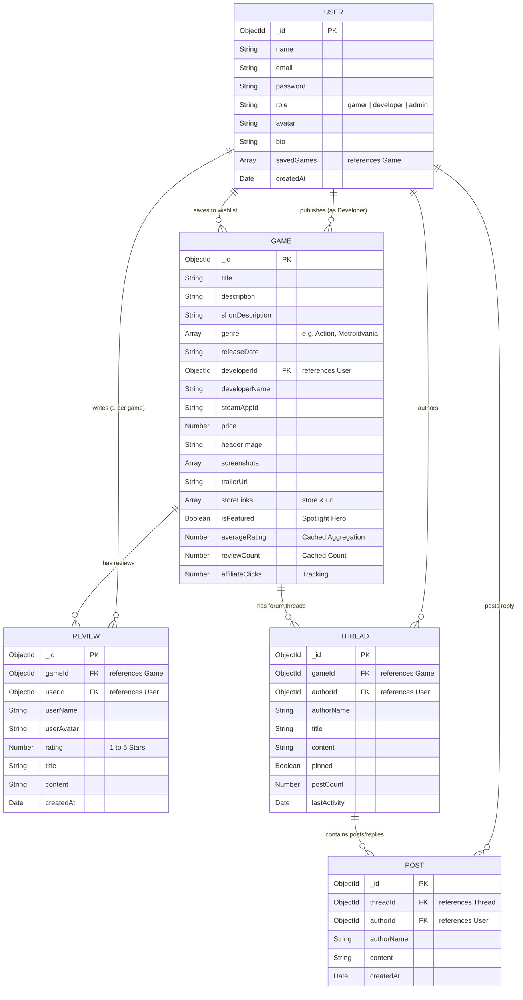

# System Design & Entity Relationship Architecture

## Overview
**IndieGamer Hub** is built on a modular Node.js/Express + MongoDB backend and Vite/React frontend architecture. The database design optimizes for high-speed discovery and social engagement by combining MongoDB schemas with cached aggregate statistics.

---

## 1. Database Entity Relationship Diagram (ERD)



---

## 2. Average Rating Aggregation Pipeline

Whenever a review is created or deleted, an Express middleware triggers the following **MongoDB Aggregation Pipeline**:

```javascript
const stats = await Review.aggregate([
  { $match: { gameId: new mongoose.Types.ObjectId(gameId) } },
  {
    $group: {
      _id: '$gameId',
      averageRating: { $avg: '$rating' },
      reviewCount: { $sum: 1 }
    }
  }
]);

await Game.findByIdAndUpdate(gameId, {
  averageRating: Math.round(stats[0].averageRating * 10) / 10,
  reviewCount: stats[0].reviewCount
});
```

> **Performance Benefit**: Pre-computing and caching `averageRating` on the `Game` collection allows single-index query sorting for catalog discovery (e.g. `Game.find().sort({ averageRating: -1 })`) without executing expensive joins at read time.

---

## 3. External API Service Architecture (`services/steamApi.js`)

```
   +-----------------------+
   |   React Frontend      |
   | (Paste Steam App ID)  |
   +-----------+-----------+
               |
               v GET /api/games/steam-preview/:appId
   +-----------+-----------+
   |   Express Backend     |
   | (services/steamApi.js)|
   +-----------+-----------+
               |
        +------+------+
        |             |
        v             v
 [Local Cache]   [Steam API]
 (Instant AppId) (store.steampowered.com)
        |             |
        +------+------+
               |
               v
   Auto-filled Metadata Payload
   (Title, Price, Genres, Header, Screenshots)
```

---

## 4. Monetization & Affiliate Tracking Flow

1. Admin toggles `isFeatured = true` on high-priority games in `/admin`.
2. Landing page queries `GET /api/games/featured` to render hero spotlight carousel.
3. Gamer clicks **Buy Now on Steam/Itch.io**.
4. Request routes through `GET /api/affiliate/redirect?gameId=...&store=Steam`.
5. Backend increments `affiliateClicks` metric on the `Game` document.
6. Server responds with target affiliate URL (`https://store.steampowered.com/app/367520/?utm_source=indiegamerhub&aff_id=IGH2026`).
